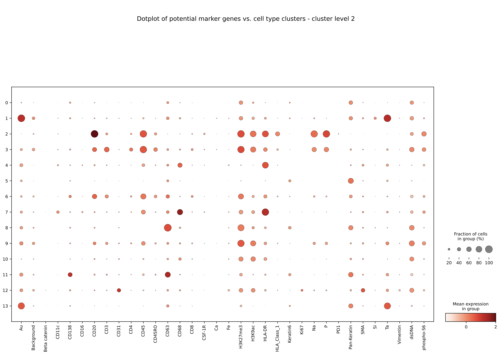

# scAnalyzer
The source code for scAnalyzer (**s**ingle and **c**ell **Analyzer**). It performs clustering and differential analyses on spatial proteomics data.

## Tutorial
### I. Clustering
#### i. Perform hierarchical clustering
- Agglomerative clustering performed using the [schist nested model](https://schist.readthedocs.io/en/latest/clustering_pbmc.html#clustering-pbmc).
- The schist nested model achieves a more fine-grained clustering as compared to Leiden or schist planted model, achieved over several clustering levels--thereby giving the user higher control over cluster analyses, and how many clusters to stop the clustering algorithm at.
###### Running the clustering algorithm:
Open command prompt/ terminal, then run:
```bash
python3 1_compute_list_of_essential_proteins_for_clustering.py <adata_pickle_path> --user_selected_cluster_level <user_selected_cluster_level>
```

The positional arguments are:
```
[1] adata_pickle_path                   Description: Specify path to anndata pickle data; type=str [read more below]
```

The optional arguments are:
```
[1] --user_selected_cluster_level       Description: Specify cluster level to get essential proteins list from; type=str [read more below]

{any_integer_value, "complete"} accepted, default is 'complete':
    - If value is integer positive: That represents the cluster level
    - If value is integer negative: That represents the cluster number in reverse order (for example: -1 represents (n-1)-th cluster)
    - If value is 'complete': That represents the last (n-th) cluster. Please note that if your input is "complete", just type it in normally without inverted commas/ quotation marks -- the program is capable of reading strings directly without any quotation symbols.
    - For all other values (i. negative integers; ii. fractional values; iii. any strings other than "complete"; iv. integer value is out of range of [1, n] where n is the total number of clusters): the default is n.
```

The outputs are:
- List of essential proteins per cluster per patient
- Dotplot of potential marker genes vs. cell type clusters (example below for **patient id: 1** of the [TNBC MIBI dataset](https://www.science.org/doi/full/10.1126/sciadv.aax5851))
<br/><br/><br/><br/>

